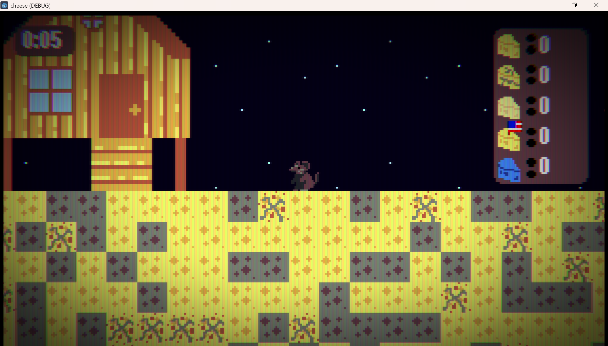

### _**Welcome to the...**_
# Galactic Rat Fromagerie

You have just been recruited by _**Galactic Cheese-Mining Enterprises™**_, the primary producer and distributor of cheese in the Rattus Caseum region of the known universe.

You are a rat who happens to live on the primary destination for natural cheese extraction: **The Moon**

Unfortunately for you, due to global warming on the moon, the temperature each night gets hot enough to spoil any cheese exposed to the air. The only way to make sure that your precious cheese is stored safely is to dump it all in your refrigerator which is in your house on the surface of the moon.

## Your mission:
- Mine as much cheese as you can every day by digging increasingly deeper into the core of the moon (which is made of cheese)
- Bring all that you can carry back to your house so that you can store it in your fridge
- Trade your cheeses in the shop to buy upgrades that make you cheese-mining more efficient
- Discover rare new cheeses that can be traded to buy exclusive items
- Bring glory to the cheese-loving rats of the universe!

---

# What is this?
This is a game that was made in 3 days by @avycado13, @CubeShifter, and @Coding-Koala222 for the [Hack Cub Horizons Nexus Hackathon](https://web.archive.org/web/20260621190236/https://nexus.hackclub.com/) in 2026.

# How can I play it?

<picture>
  
</picture>

It is available to [play on itch.io here](https://itch.io/).

# Credits
- Made with [Godot](https://github.com/godotengine/godot)
- Uses original art by @avycado13 and @CubeShifter
